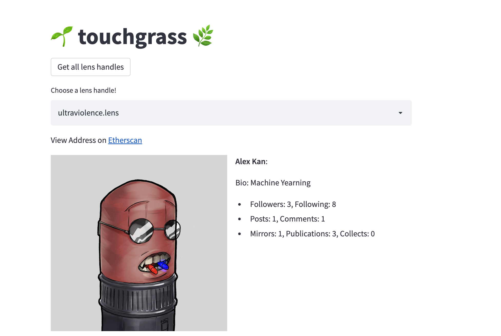
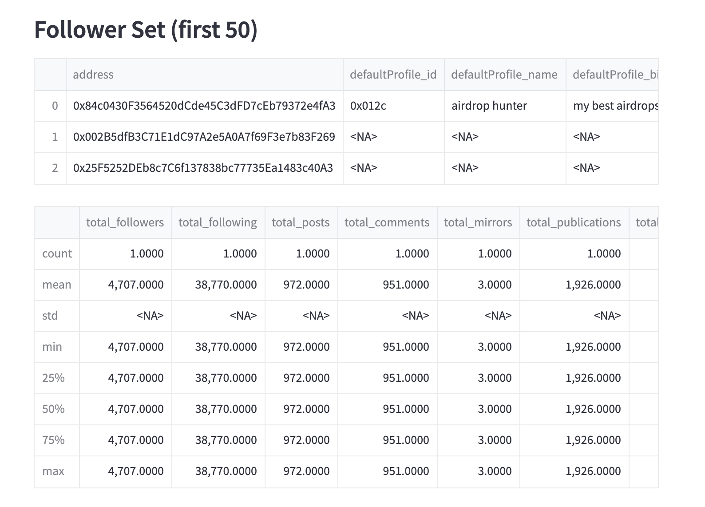
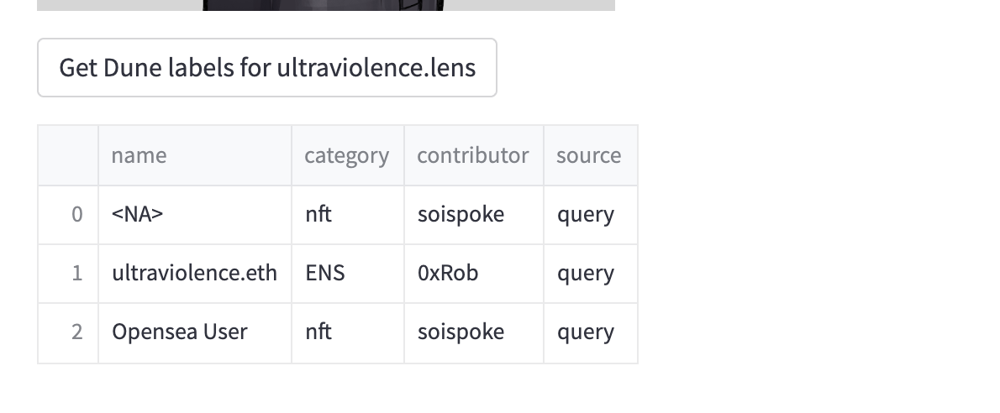

# touchgrass
# Project Description
Touchgrass is a Streamlit Dashboard for viewing stats + analytics about Decentralized Social (DeSoc) users. A user can input their Lens Handle (or search for an arbitrary one), and get back a variety of stats.

We display the user's profile picture, their name + bio, as well as data about how popular they are (# of followers, # of posts, post revenue etc.).

We can also see a subset of their followers and get summary statistics on those users as well. This is useful in terms of measuring network effects and the virality + popularity of the main user's content.

In addition to Lens' API, we also use the Dune API to get a random sample of other Lens handles to look at, and to display crowd-sourced wallet labels that may provide additional color into who the user is and what makes them special.

## How it's Made
This project is a fully-Python basked project made using a dashboarding framework called Streamlit.

We utilize the Dune API to get a random sample of Lens profile handles that users can explore. Using Lens' GraphQL API, we query a variety of metadata from the social graph pertaining to the user's profile, their followers, the revenue from their publications, and even hit IPFS to display their profile picture!

- Dune [Query](https://dune.com/queries/1527541) for Lens Handles
- Dune [Query](https://dune.com/queries/1531914) for Wallet Labels

We also pass the profile's ETH address to Dune to get user sourced wallet labels using their new Labels Spellbook product. This includes things like "NFT Trader" as well as their ENS (if any).

## How to Run

Acquire a Dune API Key and then run:
```
export DUNE_API_KEY=<REDACTED>
```

```{bash}
pip install -r requirements.txt
streamlit run landing.py
```

## Screenshots




